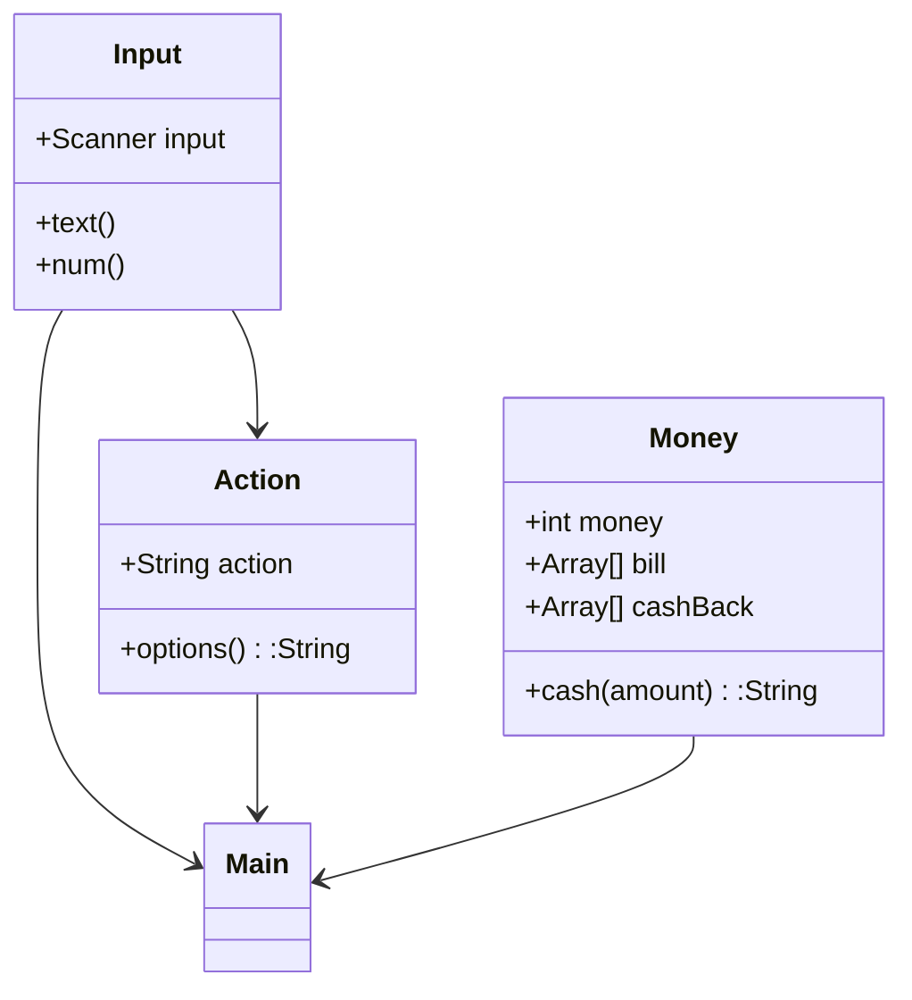

# Ejercicios Semana 7

## Ejercicio - Cajero automático
Se trata de un clásico problema de programación. Se necesita hacer un
cajero automático que de servicio a los usuarios de tal manera que, cuando
el usuario pida retirar dinero en efectivo, se muestre por pantalla la cantidad
que se retira y los billetes que se usaron, _evitando que el usuario introduzca
una cifra que no pueda ser retirada del cajero_ (cualquiera que termine en
otra cantidad que no sea 0 o 5 al no existir billetes más pequeños que los de
5 euros). **Las operaciones de retirada no pararán hasta que el usuario lo pida**.
El cajero debe de ser lo más eficiente posible con los billetes que da al
usuario, por ejemplo:

El usuario desea retirar 380 euros y se le da:
- 1 billete de 200
- 1 billete de 100
- 1 billete de 50
- 1 billete de 20
- 1 billete de 10

## Diagrama del ejercicio
### Diagrama de flujo

### Diagrama de clase

